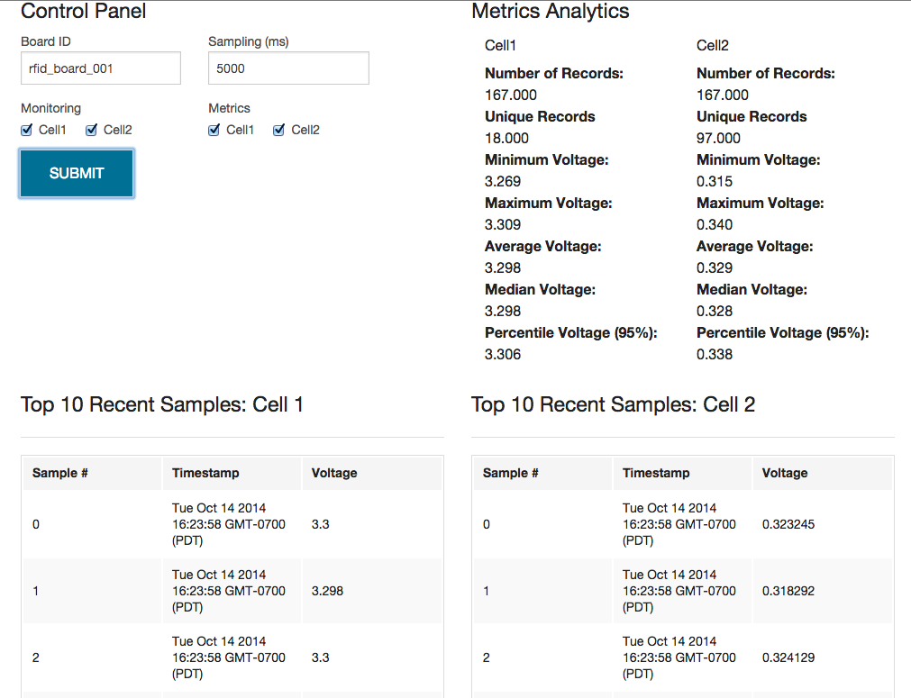

voltage_monitoring
==================

Voltage Monitoring using Electric Imp Pins and Keen.io analytics service.  Two different battery cells are monitored from the Electric Imp to gain analytics insight into each battery cell as the cell is discharged over time.  Data Collection is also used to demonstrate a collection of the "Top 10" Most Recent Samples from each battery cell.

#### Control Panel Diagram
 

